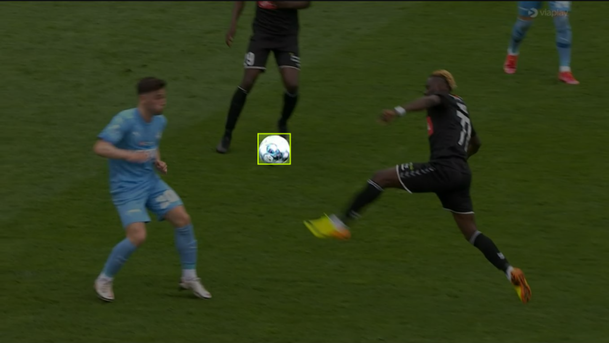
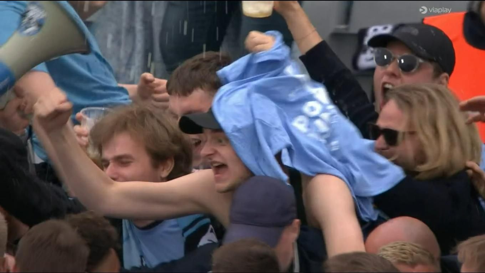
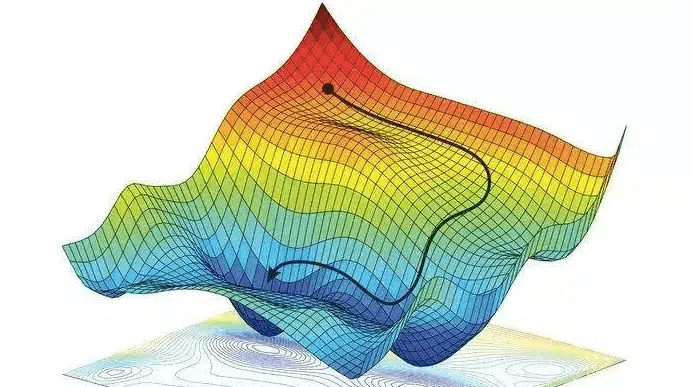
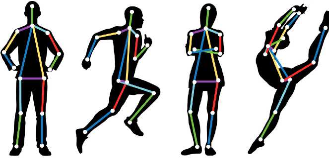
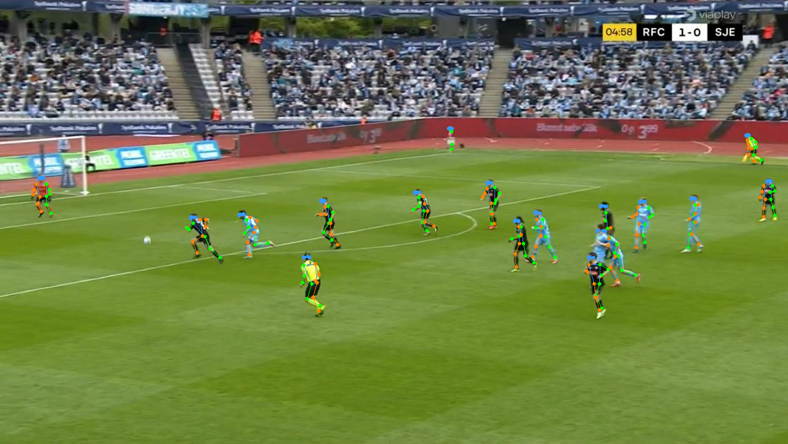
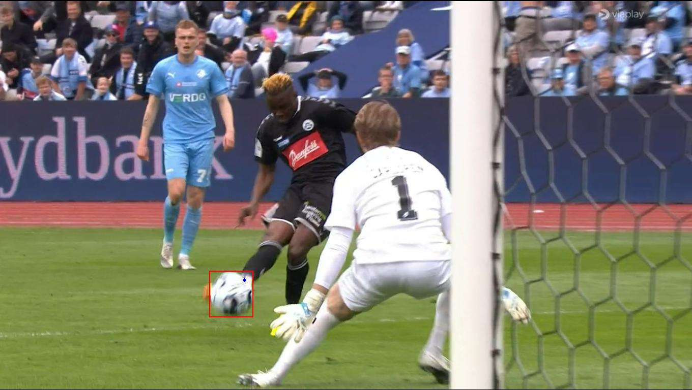
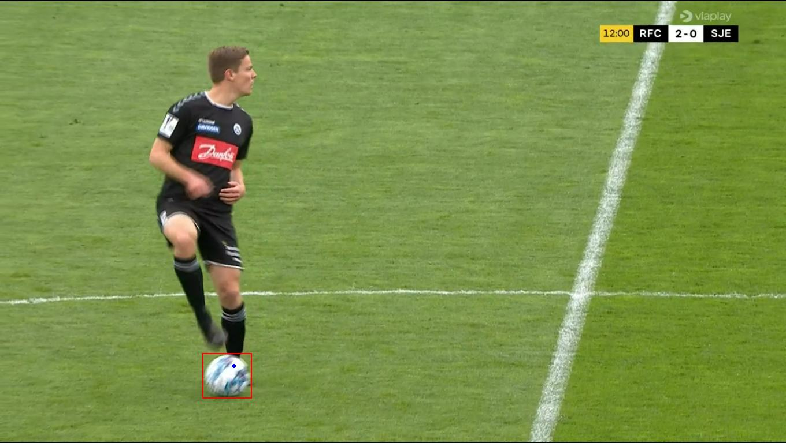

import { Image } from 'astro:assets';

## Description

This guide covers my attempts to detect kicks in a football match, either by training a classification model or by using pretrained models to our advantage.

## Objective

The objective is to develop a solution capable of determining whether a kick is taking place in a given frame, with the expectation of a proof-of-concept solution.

## Kick dataset

Before we begin, let's take a closer look at the dataset's structure. The dataset comprises of a football match captured at a rate of one frame per second. The match is split into two folders: `with_ball` and `without_ball`, both of which contain YOLOv5 annotations for bounding boxes around the ball. I initially mistakenly assumed that these bounding boxes represented the players' legs when they kicked the ball, which led to inefficient use of my time. This serves as a reminder to always double-check and ensure a clear understanding of the dataset's contents.

Now, let's proceed to examine some examples from the dataset. Below, you'll find two images, one from the `with_ball` folder and the other from the `without_ball` folder:

### 1. Image with ball



### 2. Image without ball



As expected, the first photo contains a ball, while the second one does not. Excellent! Now, before we proceed, it's important to pause for a moment. Upon further inspection of the `without_ball` folder, I encountered some questionable images. Here are two examples that caught my attention:

### 3. Example of images *"without"* ball

import image_without_ball_3 from "../../assets/images/without_ball_3.jpg"
import image_without_ball_2 from "../../assets/images/without_ball_2.jpg"


<div style="display: flex; justify-content: space-between;">
    <Image alt={"Image without Ball"} src={image_without_ball_3}  style="width: 47.5%;"  />
    <Image alt={"Image without Ball"} src={image_without_ball_2}  style="width: 47.5%;"  />
</div>

The first image is incorrectly labeled as it contains a ball, and the second image seems like an error. These examples do not mean the dataset is worthless and should be disregarded; it just means it has not been manually combed through to remove incorrect labels and ensure high quality.

With all of this in mind, let's get started!

## Attempt 1. 

The main issue with the dataset is that our objective is to detect when a kick has occurred, but no annotations have been provided to train a machine learning model. So what is the only logical solution? You guessed it! Annotate the data yourself.

To save time and keep things simple, I've decided to focus on the 'with_ball' folder and manually tag the images where players are kicking the ball. In that folder, there are 1550 images, but only 64 of them actually show players kicking the ball. Below, I've included two examples of images where I believe you can clearly see a kick happening.

## 4. Examples of kicking the ball

import image_kick_2 from "../../assets/images/kick_2.jpg"
import image_kick_1 from "../../assets/images/kick_1.jpg"

<div style="display: flex; justify-content: space-between;">
    <Image alt={"Image without Ball"} src={image_kick_2}  style="width: 47.5%;"  />
    <Image alt={"Image without Ball"} src={image_kick_1}  style="width: 47.5%;"  />
</div>

Now that we have curated a dataset, we can start our machine learning approach!

### Data Splitting

In the realm of machine learning, dividing your dataset into three sets—training, validation, and testing—is pivotal. Here is the diffrence between them

1. Training Set: This is where your model learns from the data, forming the foundation of its knowledge.

2. Validation Set: It's for fine-tuning and optimizing your model. It helps you detect overfitting and refine your model's performance.

3. Test Set: The ultimate reality check, reserved for unbiased evaluation. It ensures your model can make accurate predictions on new, unseen data.

These splits are usually weighted to  70% for training, 20% for validation, and 10% for testing. By adhering to this split, you maintain data integrity, safeguard against overfitting, and ensure your model's real-world readiness. It's a simple yet powerful practice in the journey of machine learning success.

- **Train**
  - Kick
  - No_kick
- **Val**
  - . . .
- **Test**
  - . . .

### Normalize data

Normalization is a vital preprocessing step in data science and machine learning. It's all about getting our data on an even footing before our models start learning. This is usually done by transforming our data between 1 and 0. But, our dataset might be biased in one of the two directions, to remidy this, we will calculate the mean and standard deviation of our data, and use that for our center. Normalization has the effect of making our gradient space "smoother", which will improve our optimizers ability to converge efficiently during the training process

#### 5. Image of smooth gradient space



 For the rest of the blog i will use pytorch and pytorch lightning as my preferred framework for working with deep learning. But let's get back to it. So, how do we normalize our dataset? well, we will start by going over each of the three RGB channels and calculate the mean and standard deviation for all pixels in our training dataset. 

Because our datasets can become extremely large, it's not feasible to handle everything at once. Instead, we employ a technique known as batch processing which splits up our data and let's us process it in chuncks. To achieve this, we start by creating a Dataloader object, as it will let us iterate over our dataset in batches. We then perform operations on these batches and aggregate the results at the end.

In this process, we iterate over each batch, which has a size of **(B, C, H, W)**. Here, the first index represents batches, the second corresponds to RGB channels, and the last two denote height and width. Our objective is to calculate the mean and standard deviation over the RGB channels. To achieve this, we can collapse the batch, width, and height dimensions, resulting in a tensor of size **(C)**.  In the end, we calculate the mean and std for the entire batch and add it to a total, which is printed to the console. Let's look at the code!

``` py from torchvision import datasets, transforms
from torch import zeros
from torch.utils.data import DataLoader
from tqdm import tqdm

def calc_mean_std(data_dir, batch_size, num_workers, num_channels):

    # Step 1: Define which dataset to calculate on
    dataset = datasets.ImageFolder(data_dir + "train", transform=transforms.ToTensor(),)

    # Step 2: Create a DataLoader with for batched data loading
    data_loader = DataLoader(dataset, shuffle=False, num_workers=num_workers, batch_size=batch_size, pin_memory=True)

    # Step 3: Initialize variables for mean and std
    mean = zeros(num_channels)
    std = zeros(num_channels)

    # Step 4: Calculate the mean and std for the dataset in parallel
    for inputs, _ in tqdm(data_loader, desc="==> Computing mean and std"):
        # Step 5: Compute mean and std for each channel using PyTorch operations
        mean += inputs.mean(dim=(0, 2, 3))
        std += inputs.std(dim=(0, 2, 3))

    # Step 6: Normalize the mean and std by dividing by the dataset size
    mean /= len(dataset)
    std /= len(dataset)

    print('MEAN', mean)
    print('STD', std)

    return mean, std

```

Let's run the code! Below, we have the result output for our training dataset.

- **Mean**: (0.1075, 0.1197, 0.0787)
- **STD**: (0.0441, 0.0449, 0.0513)

We will use these values to perform normalization when loading any of our data. To do this we define three datasets and how we want to load the data.

For the training transformations, we start by resizing the image, perform data augmentation, then convert it to a tensor, and lastly add the normalization we saw earlier. For the validation and testing dataset, we will do the same, but without any data augmentation.

``` py
def setup(self, stage):
    train_transform = transforms.Compose([
            transforms.Resize([self.img_height, self.img_width]),
            transforms.RandomHorizontalFlip(p=0.5),
            transforms.RandomVerticalFlip(p=0.5),
            transforms.RandomRotation(degrees=(30, 70)),
            transforms.ToTensor(),
            transforms.Normalize(self.data_mean, self.data_std),
    ])

    val_transform = transforms.Compose([
            transforms.Resize([self.img_height, self.img_width]),
            transforms.ToTensor(),
            transforms.Normalize(self.data_mean, self.data_std),
    ])

    self.train_ds = datasets.ImageFolder(self.data_dir + 'train', transform=train_transform)
    self.val_ds = datasets.ImageFolder(self.data_dir + 'val', transform=val_transform)
    self.test_ds = datasets.ImageFolder(self.data_dir + 'test', transform=val_transform)

```

That is all regarding data preproccesing, let's look at some ML models!

## Define ML model

To begin with, we will define a simple Dense Neural Network. There are many much better and more efficient methods, such as Convolutional Neural Networks and even transformer-based neural networks. However, this is slightly out of scope for this project.

## Define hyperparamets

Talk about the hyperparamets used and the reason for it

## Train

Talk about how pytorch lighting come with a runtime that allows for training on any kind of hardware and is really helpful for incapsulating the dataset from the models and training by providing structure. 


## Evaluate results

Talk about the results being 96.511% accurate in the first go! But that it came with a caveat. The model didn't learn anything. When doing investigations on the test dataset, the model would always guess that no kick has occured and since the dataset is heavily unbalanded it would just guess for the same thing.

Also visualize the training process by comparing the loss and accuracy of the training and validation. 

## Hyperparameter tuning
To remidy the unbalanced dataset i applied a weighting to the loss function that will give 25x more feedback to the network when the data label is of a kick. 

Also try change some hyperparamets like learning rate, network deph and even convolutional Networks

## Conclusion
The ml model had a very difficult time diffirenciating between the kick and no_kick data and i attribute two factors that could solve this problem.
1. The first is to use a larger model that is able to run for larger images, the curret model heavily resizes the image for efficiency reasons. 
1. Get better labels for the data. we could instead capture the match at a higher framerate and annotate each time the ball and a player is in contact with each other, this criteria is easier for humans to effectively label


# Attempt. 2
For this attempt i have decided to go another route that does not have to do with training a deep learning model. Instead we will utilize trained models to create metadata and then engineer a herutic approach to detirmine if a kick is being made. For an example of pose estimation see the below image:

### 6. Pose estimation example




My idea is that we could run our dataset through a pose estimation algorithm to get an estimatoin of our players feet. Then if the feet of a player is colloding with a ball then we have detectded a kick!

To implement this we first have to extract the poses of the players, to do this i went to openmmlabs wide range of frameworks and chose their mmPose framework to performn inference on our dataset. They have a convinient script where you can point to your dataset and it will create the pose annotations for all images within that folder. Below is an exampleof all the poses calculated for a game.

### 7. MMPose inference example



After letting my pc suffer for 2 hours while i was away, the intire dataset finished and we can begin creating our heuristic approach to detect when a kick has happened or in this way. When a foot and ball are overlapping. 

The prediction made by MMPose have been give in the COCO format and is formatted as 17 keypoint for each player. These keypoints are described in the following

1. Nose
2. Left Eye
3. Right Eye
4. Left Ear
5. Right Ear
6. Left Shoulder
7. Right Shoulder
8. Left Elbow
9. Right Elbow
10. Left Wrist
11. Right Wrist
12. Left Hip
13. Right Hip
14. Left Knee
15. Right Knee
16. Left Ankle
17. Right Ankle

Since we only care about the legs of the players we should only consider the last four keypoints of the knees and angles. My idea is that for each frame we will go through all players keypoints and check if their last four keypoints are within a one of the balls bounding boxes. 

#### To do this we will need the following functions. 

- `is_keypoint_within_bbox`
- `load_bbox`
- `load_keypoints`
  
#### And helper functions
- `get_unique_filenames_in_folder`
- `visualize_bbox_and_keypoint`


The code will read my dataset folder and get all the unique filenames, ie. `59304241` and save it to a list of unique_filenames. We will then iterate over each unique filename and create a path to the bbox, keypoints, image and output image. 

The bounding box and list of the players keypoints is then loaded and iterated over. For each keypoint and bbox, we check for a collision. If it is one,  remember the file and visualize the result in a seperate folder. Below is the final implemented code for doing this

``` py
dataset_path = 'kick_detection_case/with_ball/'
destination_folder = 'predictions/'
unique_filenames = list(get_unique_filenames_in_folder(dataset_path))
overlapping_kicks = set()

for filename in unique_filenames:
   bbox_path = os.path.join(dataset_path, filename + ".txt")
   keypoints_path = os.path.join(dataset_path, filename + ".json")
   image_path = os.path.join(dataset_path, filename + ".jpg")
   output_path = os.path.join(destination_folder, filename + ".jpg")

   bounding_boxes = load_yolov5_annotations(bbox_path)
   keypoints_list = load_pose_estimation(keypoints_path)
   
   for bounding_box in bounding_boxes:
       for keypoints in keypoints_list:
           for keypoint in keypoints:
                if (is_keypoint_inside_bbox(keypoint, bounding_box)):
                    if filename not in overlapping_kicks:
                        overlapping_kicks.add(filename)
                        visualize_bbox_and_keypoint(image_path, bounding_box, keypoint, output_path)

```


After fixing some bugs with loading in the data i got the script to work, and this is the result of my labor. 

### 8. Example of correct kick detection




### 9. Example of incorrect kick detection




### 10. All Examples of kick detection


import image_kick_detect from "../../assets/images/kick_detection_1.gif"


<Image alt="Image without Ball" src={image_kick_detect} width={720} height={360} />


## Conclusion
Our heristic approach for detecting kicks is able to detect when a ball is overlapping with a players foot, but there are issue when there are more than one ball in the frame. The wrong ball might be detected in this case. 

For future improvements we can try to filter out the incorrect balls by detecting what color surrounds the ball and if it is green ie. the football field, then it should be used.

